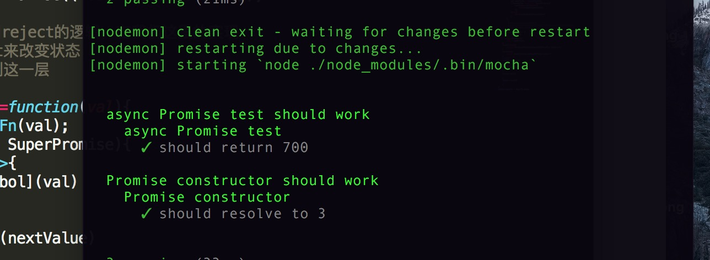

# V8-promise

> A hand-write promise implementation with simpler logic

> main logic only 130 line codes

## basic utilities

- 异步处理的microtask 

> in browser : use mutationObserver

> in Node.js : use process.nextTick

- 避免enumerate的symbol

> use symbol to avoid exposure of inner method

## mocha 测试结果

## copyright

> @slashhuang  

